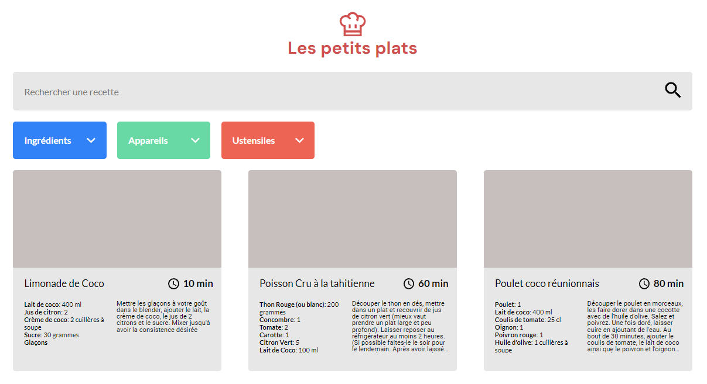

# Les Petits Plats

## Presentation

## Live demo of Les Petits Plats app is available on Github Pages [here](https://zhannazucher.github.io/LesPetitsPlats/)

### Project goals : 
1. Develop the search engine for recipes including global search and refine the search with tags. Two versions of search engine are implemented : first one based on functional approach and the second one using native loops. The most powerful and efficient version for this project is selected for deployment.
2. Explant the search engine algorithm logic with UML.
3. Run benchmark tests.
4. The most powerful and efficient version for this project is selected for deployment.

 ### Analysis report with UML schema, benchmark results and comparative analysis for both versions is available [here](https://github.com/ZhannaZucher/LesPetitsPlats/blob/master/report.pdf)

## Local setup

1. Clone and/or fork this repository.
2. Then start your Live Server